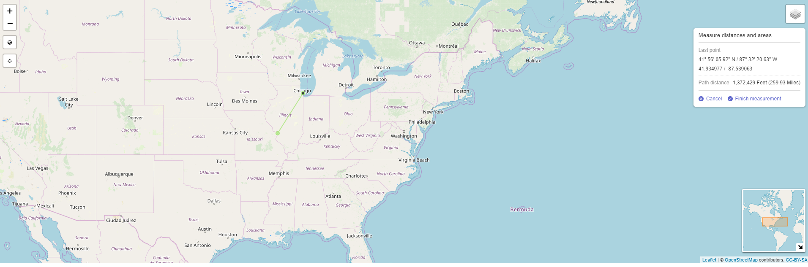

# Interactive Map
This application is an Interactive Map that allows a user to zoom in and out and search similar to google maps. The mapp also allows a user to measure distances on a map and to change the background layout of the map as well. There is also a location feature built into the map to find where you are located. 

### Interactive Map: Basic Display

---

### Interactive Map: Measure distances

---

### OSM

---

### Toner

---

### Toner Lite

---

### Watercolor

---

### ESRI

---

### ESRI2

---

